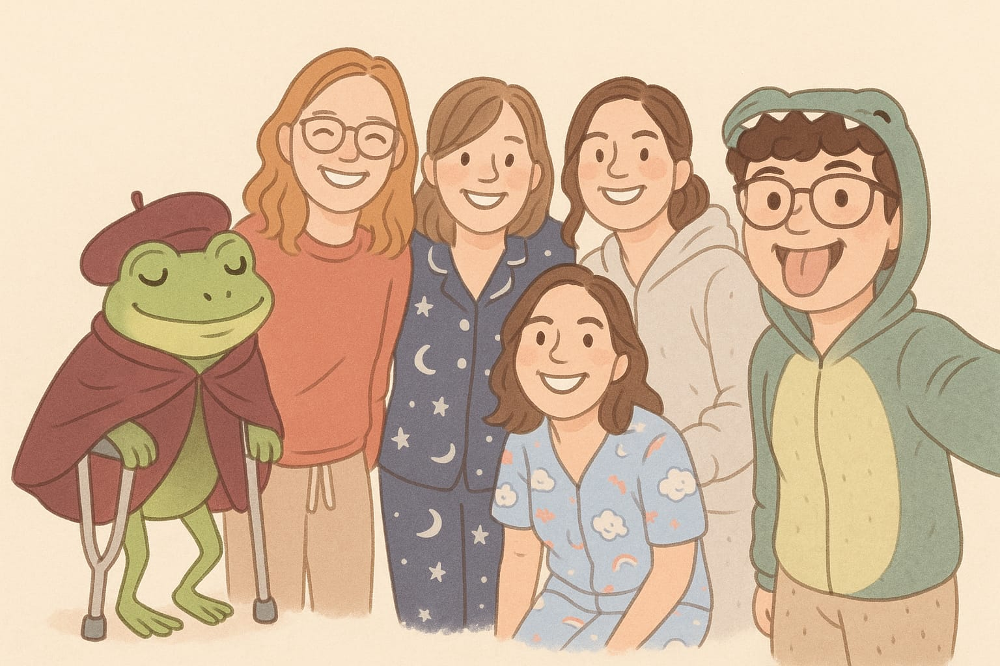

# Wordpuzzle Game Master for Lucry's 30th Birthday Party 🎉

**Repository:** `game-master-for-Lucry-s-birthday-party`  
**Type:** just for fun  
**Duration:** half a day  
**Deadline:** 04/07/2026, 19:30

---

## 📋 Project Overview
Crucipuzzle Game Master is a lightweight, interactive static web application designed as a personalized puzzle game for Lucry's 30th birthday party.

The application serves as a digital companion to a physical, paper-based word search puzzle (wordpuzzle). The user interacts with a grid of covered, numbered cards, each hiding a visual clue related to shared memories or inside jokes. Upon entering the correct answer for a clue, the system unlocks and reveals a secret word. The user must then find and cross out this word within the physical puzzle grid. 

---

## ⭐️ Project Summary

### 📌 Situation
For Lucry's 30th birthday party, we wanted to create a memorable, interactive experience by combining a traditional, paper-based word search puzzle (wordpuzzle) with a digital twist. The core challenge was to design a supporting game interface that could serve as a secure "Game Master"—safeguarding the puzzle's secret solutions behind encrypted or hidden states while allowing the player to unlock clues sequentially on their own device without relying on any active server infrastructure or database.

### 🎯 Task
To achieve this, the application needed to fulfill three primary constraints:  
- it had to decouple the game content from the rendering layout by using a Python script to dynamically generate the data structures;  
- it required a fully client-side architecture capable of handling user input, string validation, and state persistence natively within the browser;  
- the final output had to be completely serverless and lightweight so it could be deployed instantly as a standalone static site on GitHub Pages.

### 🛠️ Action
To build this solution, I implemented a data-driven build pipeline using Python and a responsive frontend layout using vanilla web technologies:

- **Pipeline Infrastructure**: Created an orchestrator script (`main_game_master_builder.py`) that executes a modular configuration setup, extracting local asset references and mapping solutions to distinct IDs before exporting the centralized database structure to a serializable JSON file (`data/game_data.json`).

- **Dynamic Frontend Generation**: Developed an HTML/CSS/JavaScript template engine that reads the generated JSON payload asynchronously via runtime API fetch requests, eliminating static injection and building out the card components dynamically.

- **Component Optimization & Interaction**: Built a modern, CSS-driven lightbox system that seamlessly detaches active cards from the main flexbox/grid view and expands them into a full-screen, high-resolution focus view. This behavior includes dedicated state handling for validation, localized alert loops, and a standalone dismissal mechanism.

- **Client-Side Validation & State Persistence**: Engineered an inline sanitization function (`cleanString`) in JavaScript to force character uniformity, stripping white spaces and specialized tokens prior to solution matches. Integrated the browser’s native `localStorage` API to dynamically read and write cell milestones, ensuring user progression persists independently across navigation cycles without back-end mutations.

### 🏆 Result

The resulting application delivered a flawless, zero-latency interactive companion game deployed instantly via GitHub Pages. The implementation of the full-screen lightbox transition successfully resolved image readability constraints on mobile devices, providing high-resolution clarity for the visual clues. Furthermore, the combination of client-side input sanitization and localStorage integration ensured a seamless user experience, allowing the player to progress through the game at their own pace without data loss or frustration from minor typographical errors. Ultimately, the system met all architectural goals: it remained completely serverless, required zero operational overhead during the event, and isolated the solution data efficiently.

---

As an expatriate, this short and simple project was my way to be present at one of most memorable events that a group of friends experiences: a memeber turning 30.
I wasn't able to attend in person such a milestone of one of the dearest friends I've ever had due to distance, but I hope the result of this project helped reminding to her and all other "Buddh-anas" that I care about them and always carry all of them with me. ❤️

<figure style="text-align: center;">
    
    <figcaption><i></i>Me and the me and my beloved "Buddh-anas", together with our friend Fra Nocchia, the frog friar on crutches.</figcaption>
</figure>